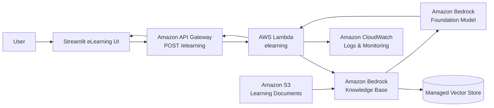

# 🎓 Tech Cloud Byte — Serverless eLearning RAG Application on AWS

> A serverless, Retrieval-Augmented Generation (RAG) based eLearning assistant built with **Amazon Bedrock, Amazon Bedrock Knowledge Bases, AWS Lambda, Amazon API Gateway, Amazon S3, and Amazon CloudWatch**.

Tech Cloud Byte is an internal learning companion designed to answer questions using an organization's curated learning material instead of relying only on a foundation model's general knowledge.

---

## 📌 Project Overview

**Tech Cloud Byte** provides an AI-powered learning interface where users can ask questions about AI concepts, tools, and internal learning material.

The application follows a RAG architecture:

1. Learning documents are uploaded to **Amazon S3**.
2. **Amazon Bedrock Knowledge Bases** ingest and index the documents.
3. User questions are submitted through the application.
4. **Amazon API Gateway** exposes a REST endpoint.
5. **AWS Lambda** receives the request and interacts with Amazon Bedrock.
6. The Bedrock Knowledge Base retrieves relevant information.
7. The retrieved context is used to generate a grounded answer.
8. **Amazon CloudWatch** records the Lambda execution and RAG-related logs.

This architecture keeps the application serverless and separates the user interface, API layer, compute layer, knowledge layer, and observability layer.

---

## ✨ Key Features

- 🤖 AI-powered eLearning assistant
- 📚 Answers grounded in an organization-specific knowledge base
- 🔎 Retrieval-Augmented Generation (RAG)
- ☁️ Fully serverless AWS backend
- ⚡ API-driven Lambda inference workflow
- 🗂️ Document storage through Amazon S3
- 🧠 Amazon Bedrock Knowledge Base for semantic retrieval
- 📊 CloudWatch logging and execution monitoring
- 🔌 REST API through Amazon API Gateway
- 🎓 Learning-focused Streamlit user interface

---

## 🏗️ Architecture



### 🔄 Request Flow

```text
User
  │
  ▼
Streamlit Application
  │
  │ POST /elearning
  ▼
Amazon API Gateway
  │
  ▼
AWS Lambda
  │
  ├──► Amazon Bedrock Knowledge Base
  │        │
  │        └──► Retrieve relevant document context
  │
  └──► Amazon Bedrock model
           │
           └──► Generate grounded answer
  │
  ▼
API Gateway
  │
  ▼
Streamlit UI
```

---

# ☁️ AWS Services Used

| AWS Service | Role in the Project |
|---|---|
| **Amazon Bedrock** | Provides foundation-model and generative AI capabilities used to produce responses. |
| **Amazon Bedrock Knowledge Bases** | Provides the RAG knowledge layer for retrieving relevant information from uploaded learning documents. |
| **Amazon S3** | Stores the source documents used by the Knowledge Base. |
| **AWS Lambda** | Runs the backend logic without managing servers. |
| **Amazon API Gateway** | Exposes the Lambda backend through a REST API endpoint. |
| **Amazon CloudWatch** | Captures Lambda execution logs and RAG workflow information for debugging and monitoring. |
| **AWS Lambda Layers** | Packages reusable dependencies for the Lambda function; the project uses a custom `boto3_bedrock` layer. |

---

# 🧠 Understanding the RAG Pipeline

## What is RAG?

Retrieval-Augmented Generation combines two stages:

### 1. Retrieval

When the user asks a question, the system searches the project's knowledge base for relevant information.

```text
User Question
     ↓
Semantic Search
     ↓
Relevant Knowledge
```

### 2. Generation

The retrieved information is supplied to the generative AI workflow so the model can formulate an answer using the available context.

```text
Retrieved Context + User Question
              ↓
       Bedrock Model
              ↓
        Final Answer
```

This makes the application useful for organization-specific learning material that may not be part of a model's general training knowledge.

---

# 📚 Knowledge Base Setup

The project contains a Bedrock Knowledge Base named:

```text
eLearning-kb
```

The screenshots show the Knowledge Base configured as a **managed vector store** with an Amazon multimodal embedding model.

The Knowledge Base is connected to a data source containing learning documents uploaded to Amazon S3.

### Documents uploaded

The demonstrated S3 upload contains:

- `Enterprise_AI_Guidance.pdf`
- `gen-ai-inference-architecture-and-...pdf`
- `AmazonBedrock_UserGuide.pdf`

The exact filenames visible in the AWS console can be retained when documenting the actual repository.

---

# 🪣 Amazon S3 Data Source

Learning material is uploaded to an S3 bucket before it is synchronized with the Knowledge Base.

The demonstrated upload successfully transferred:

```text
3 files
4.8 MB total
0 failed
```

This creates the document layer used by the RAG system.


---

# 🧬 Embeddings

The Knowledge Base uses an Amazon embedding model to convert document content into vector representations.

These vectors allow semantic similarity search instead of relying only on exact keyword matching.

```text
Document
   ↓
Embedding Model
   ↓
Vector Representation
   ↓
Vector Store
```


---

# 🧠 Knowledge Base Creation

The completed Knowledge Base is shown as:

```text
eLearning-kb
Status: Available
Knowledge Base Type: Managed vector store
```

The AWS console also shows the configured embedding model and vector dimensions.


---

# ⚙️ AWS Lambda Backend

The backend Lambda function is named:

```text
elearning
```

Its responsibilities include:

- Receiving the API request
- Reading the user's prompt
- Calling the Bedrock/RAG workflow
- Processing the retrieved information
- Returning the generated response

The Lambda function is connected to API Gateway.


---

# 📦 Lambda Layer

A custom Lambda layer named:

```text
boto3_bedrock
```

was created and attached to the Lambda function.

The layer is used to provide reusable Python dependencies required by the Bedrock integration.


---

# 🔌 Amazon API Gateway

The application exposes a REST API through API Gateway.

The demonstrated resource is:

```text
/elearning
```

with:

```text
POST
```

as the HTTP method.

The API method is configured with a **Lambda integration**.


### API Flow

```text
Client
  ↓
POST /elearning
  ↓
API Gateway
  ↓
Lambda Integration
  ↓
elearning Lambda
```

---

# 🚀 API Deployment

The API has a deployment stage named:

```text
prompt
```

The AWS console shows a successfully created deployment and an active invoke URL.


> **Security note:** Do not publish a live API Gateway invoke URL publicly unless the endpoint is properly authenticated and protected.

---

# 🧪 API Testing

The API Gateway console was used to test the `/elearning` POST endpoint.

A sample request used:

```json
{
  "prompt": "what is bedrock"
}
```

The request successfully reached Lambda and returned an HTTP `200` response.


---

# 🤖 Lambda + Bedrock Execution

The Lambda execution demonstrates the connection between the API request and the Bedrock RAG workflow.

The request:

```text
what is bedrock
```

is passed into the backend, which invokes the Bedrock workflow and processes the resulting response.


---

# 🖥️ Application Interface

The frontend is presented as a learning assistant called:

## Tech Cloud Byte

The interface provides:

- Learning Paths
- My Progress
- Company Knowledge Base
- AI learning assistant
- Learning session
- Question input
- Online assistant status

The application emphasizes that answers are grounded in the organization's internal knowledge base.


---

# 📊 Observability with Amazon CloudWatch

CloudWatch logs provide visibility into the Lambda execution.

The captured logs show stages including:

```text
User Query
    ↓
Raw data retrieved from Knowledge Base
    ↓
Retrieval processing
    ↓
Agent planning
    ↓
Generated response
    ↓
Citations
    ↓
Final result
```

For the demonstrated request, the logs contain the question:

```text
what is bedrock
```

and show successful retrieval and response generation.


---

# 🔐 Security Considerations

For a production deployment, the following controls should be considered:

- Use least-privilege IAM policies.
- Avoid hard-coding AWS credentials.
- Protect API Gateway with an appropriate authentication mechanism.
- Restrict S3 bucket access.
- Encrypt sensitive data at rest and in transit.
- Avoid logging sensitive user data.
- Configure CloudWatch retention according to project requirements.
- Use separate development and production environments.
- Store secrets in AWS Secrets Manager or AWS Systems Manager Parameter Store when required.

---

# 💰 Cost Considerations

This architecture is serverless, so there is no always-running application server to manage.

Potential cost areas include:

- Amazon Bedrock model usage
- Bedrock Knowledge Base retrieval and vector storage
- S3 storage and requests
- AWS Lambda invocations and compute duration
- API Gateway requests
- CloudWatch log ingestion and storage

Actual cost depends on request volume, model selection, document size, retrieval configuration, and retention settings.

---

# 🧪 Example Interaction

### User

```text
What is Amazon Bedrock?
```

### Backend workflow

```text
Streamlit
   ↓
API Gateway
   ↓
Lambda
   ↓
Bedrock Knowledge Base
   ↓
Relevant knowledge retrieved
   ↓
Bedrock generation
   ↓
Lambda response
   ↓
Streamlit
```

### Result

The assistant returns an answer grounded in the available learning material.

---

# 📂 Suggested Repository Structure

Once the application source code is added, a clean GitHub repository can follow this structure:

```text
elearning-rag-aws/
│
├── app/
│   ├── app.py
│   ├── requirements.txt
│   └── ...
│
├── lambda/
│   ├── lambda_function.py
│   └── requirements.txt
│
├── docs/
│   ├── architecture.md
│   └── images/
│
├── README.md
├── .gitignore
└── LICENSE
```

> Rename the source-code files above to match your actual project files. The documentation package currently contains the screenshots and documentation, not the application's source code.

---

# 🚀 High-Level Deployment Steps

## 1. Prepare the knowledge documents

Collect the approved eLearning / AI reference material.

## 2. Upload documents to Amazon S3

Create or select an S3 bucket and upload the documents.

## 3. Create the Bedrock Knowledge Base

Configure:

- Knowledge Base
- Data source
- Embedding model
- Vector storage
- IAM execution role

## 4. Synchronize the data source

Run synchronization so the documents are processed and indexed.

## 5. Create the Lambda function

Implement the backend logic that receives the user's question and invokes the Bedrock RAG workflow.

## 6. Add required Lambda dependencies

Create and attach the required Lambda layer/dependencies.

## 7. Create API Gateway

Create:

```text
POST /elearning
```

and integrate it with Lambda.

## 8. Deploy the API

Create an API Gateway stage and deploy the API.

## 9. Connect the frontend

Configure the Streamlit application to send the user's question to the API endpoint.

## 10. Monitor with CloudWatch

Use CloudWatch logs to inspect:

- Lambda execution
- Retrieval
- Generated responses
- Errors
- Request latency

---

# 🛠️ Technology Stack

```text
Frontend
└── Streamlit

Backend
└── Python
└── AWS Lambda

Generative AI
└── Amazon Bedrock

RAG
└── Amazon Bedrock Knowledge Bases
└── Embeddings
└── Managed Vector Store

Storage
└── Amazon S3

API
└── Amazon API Gateway

Monitoring
└── Amazon CloudWatch

Dependencies
└── boto3 / Bedrock-related Lambda Layer
```

---

# 🔮 Future Improvements

Potential extensions include:

- 🔐 Add Cognito-based user authentication
- 👤 Add individual learner profiles
- 📈 Track learning progress
- 🧠 Add personalized learning recommendations
- 📝 Generate quizzes from retrieved content
- 🎯 Add skill assessments
- 📚 Add multiple knowledge domains
- 💬 Maintain conversational history
- 📊 Build CloudWatch dashboards
- ⚡ Add response caching where appropriate
- 🛡️ Add Bedrock Guardrails
- 🔑 Implement stronger API authorization
- 📱 Deploy the frontend instead of running locally
- 🧪 Add automated API and RAG evaluation

---

# 🎯 Learning Outcomes

This project demonstrates practical experience with:

- Retrieval-Augmented Generation
- Generative AI application development
- Amazon Bedrock
- Bedrock Knowledge Bases
- Vector embeddings
- Serverless architecture
- AWS Lambda
- API Gateway
- Amazon S3
- CloudWatch observability
- Python-based AI integration
- API-driven application design

---

# 👨‍💻 Project

**Tech Cloud Byte — Serverless eLearning RAG Application**

Built using AWS serverless and generative AI services to create a knowledge-grounded learning assistant.

---

## ⚠️ Before Publishing to GitHub

The screenshots in this documentation package are the original AWS console screenshots. Before making the repository public, review them for:

- AWS account IDs
- API Gateway URLs
- ARNs
- Resource IDs
- Internal document names
- Internal/company information
- Any other environment-specific identifiers

Where appropriate, replace or redact these values in screenshots and documentation.

---

## ⭐ If you found this project useful

Consider starring the repository and using the architecture as a starting point for your own AWS RAG applications.
